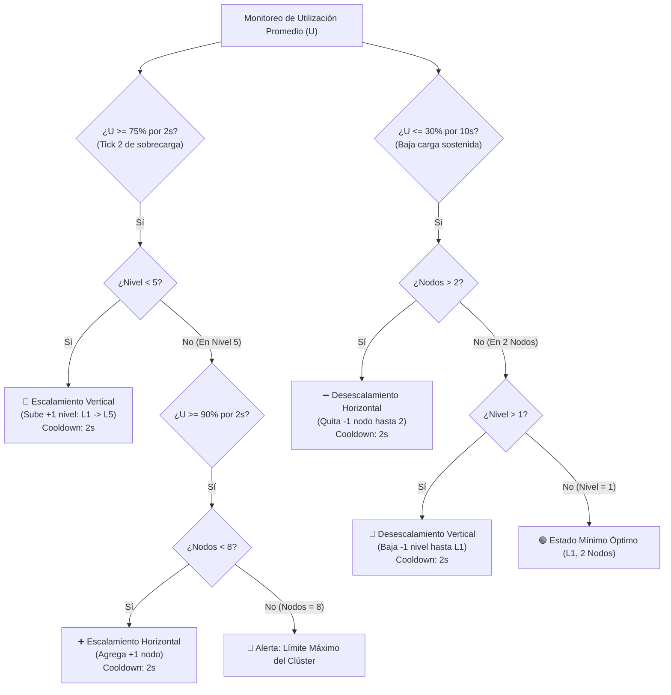

# Arquitectura y Diseño: Simulador de Clúster con Load Balancer y Auto-Scaling Jerárquico (Vertical $\rightarrow$ Horizontal)

Este documento describe la arquitectura, las políticas de decisión, la calibración temporal y los detalles de implementación del simulador de clúster con **Balanceador de Carga (Load Balancer)** y motor de **Autoescalamiento Jerárquico en 2 Ticks**.

---

## 1. Resumen Ejecutivo y Objetivos

El sistema simula un clúster de servidores web que atiende tráfico variable en tiempo real ($req/s$). El objetivo principal es optimizar costos operativos manteniendo alta disponibilidad y respetando una **jerarquía estricta de escalado**:

1. **Scale-Up Vertical Primero (Agotar capacidad de cómputo individual):**
   - Ante un incremento sostenido de tráfico, el sistema aumenta primero el tipo de instancia (L1 $\rightarrow$ L2 $\rightarrow$ L3 $\rightarrow$ L4 $\rightarrow$ L5) manteniendo el clúster compacto y minimizando la complejidad de red.
2. **Scale-Out Horizontal como Segunda Línea (Tope vertical alcanzado):**
   - Únicamente cuando las instancias ya se encuentran en el nivel máximo (**Nivel 5**) y la utilización persiste en zona crítica ($U \ge 90\%$), el sistema escala horizontalmente añadiendo nodos réplica (hasta un máximo de 8).
3. **Desescalamiento Continuo de Retorno (Scale-In Horizontal primero $\rightarrow$ Scale-Down Vertical):**
   - Cuando el tráfico cae por debajo del umbral de baja carga ($U \le 30\%$) de forma sostenida (10s), el sistema:
     - Primero retira los nodos adicionales hasta llegar a la base de **2 nodos**.
     - Una vez en 2 nodos, reduce gradualmente el nivel vertical (L5 $\rightarrow$ L4 $\rightarrow$ L3 $\rightarrow$ L2 $\rightarrow$ L1).

---

## 2. Calibración Temporal: La Regla de Reacción al 2º Tick

### 2.1 El problema de la ventana inicial (5 segundos vs. 3 ticks de caída)
- **Tolerancia del servidor:** Un servidor bajo sobrecarga crítica ($\ge 100\%$) acumula timeouts y **cae al 3er segundo consecutivo** (`TICKS_PARA_CAER = 3`).
- **Problema de la ventana de 5s:** Si el autoescalador espera 5 segundos para reaccionar, los servidores colapsan en el segundo 3 antes de poder ejecutar el escalado.
- **Problema de la reacción instantánea (Tick 1):** Si el autoescalador reacciona de inmediato en el segundo 1, el usuario **no alcanza a distinguir visualmente que el tráfico subió**, ya que la barra escala antes de que se aprecie la sobrecarga.

### 2.2 La Solución Óptima: Ventana de Evaluación de 2 Ticks (2 Segundos)
Ajustando la ventana de decisión a **2 ticks sostenidos**:
- **Tick 1 (Percepción Visual):** El tráfico impacta el clúster. La barra en el Canvas sube por encima del umbral, cambia de color (amarillo $\rightarrow$ rojo) y la latencia aumenta. El usuario distingue claramente el incremento de carga.
- **Tick 2 (Reacción y Salvación):** El motor de autoescalado confirma 2 segundos sostenidos de sobrecarga y **ejecuta el escalado vertical (+1 nivel)**.
- **Tick 3 (Resultado Seguro):** La nueva capacidad absorbe la carga, reduciendo la utilización y **reseteando el contador de sobrecarga a 0**. Ningún servidor cae.

```
Segundo 1                    Segundo 2                    Segundo 3
┌─────────────────────────┐  ┌─────────────────────────┐  ┌─────────────────────────┐
│ • Pico de tráfico entra │  │ • Sobrecarga confirmada │  │ • Nueva capacidad entra │
│ • Barra sube a >100%    │  │ • Auto-scaler REACCIONA │  │ • Carga baja < 100%      │
│ • Usuario VE el pico    │  │ • Sube a L(N+1)         │  │ • 0 servidores caen     │
└─────────────────────────┘  └─────────────────────────┘  └─────────────────────────┘
```

---

## 3. Especificaciones y Parámetros del Sistema

### 3.1 Niveles de Instancia (Escalamiento Vertical)
| Nivel | Instancia | Capacidad individual ($req/s$) | Costo relativo |
| :--- | :--- | :--- | :--- |
| **L1** | `m5.large` | 50 | $1\times$ |
| **L2** | `m5.xlarge` | 90 | $2\times$ |
| **L3** | `m5.2xlarge` | 150 | $4\times$ |
| **L4** | `m5.4xlarge` | 210 | $8\times$ |
| **L5** | `m5.8xlarge (máx.)` | 260 | $16\times$ |

*Nota:* La capacidad crece de forma **sublineal** mientras el costo se duplica exponencialmente en cada nivel.

### 3.2 Límites del Clúster
- **Nodos activos:** Mínimo **2** (redundancia activa) · Máximo **8**.
- **Niveles de instancia:** Mínimo **L1** · Máximo **L5**.

### 3.3 Umbrales, Tiempos Sostenidos y Cooldowns
- **Métrica de decisión ($U$):** Utilización Promedio de los nodos activos:
  $$U = \frac{\sum_{i \in \text{activos}} \text{utilización}_i}{|\text{activos}|}$$
- **Scale-Up Vertical:** $U \ge 75\%$ durante **2 segundos seguidos** $\rightarrow$ Sube $+1$ nivel. Cooldown: **2s**.
- **Scale-Out Horizontal:** Si Nivel $= 5$ y $U \ge 90\%$ durante **2 segundos seguidos** $\rightarrow$ Agrega $+1$ nodo. Cooldown: **2s**.
- **Scale-In Horizontal:** $U \le 30\%$ durante **10 segundos seguidos** $\rightarrow$ Quita $-1$ nodo (hasta mínimo 2). Cooldown: **2s**.
- **Scale-Down Vertical:** Si Nodos $= 2$ y $U \le 30\%$ durante **10 segundos seguidos** $\rightarrow$ Baja $-1$ nivel (hasta mínimo L1). Cooldown: **2s**.

---

## 4. Árbol de Reglas de Decisión



---

## 5. Arquitectura de Software del Simulador

```
┌─────────────────────────────────────────────────────────────┐
│                   Tráfico Entrante (req/s)                 │
│              (Slider interactivo + botón de pico)           │
└──────────────────────────────┬──────────────────────────────┘
                               │
                               ▼
┌─────────────────────────────────────────────────────────────┐
│ 1. LOAD BALANCER (Balanceador de Carga)                    │
│    • Filtra nodos_activos() (excluye caídos)                │
│    • Distribuye el tráfico equitativamente entre nodos     │
│      con dispersión realista (±5%)                         │
└──────────────────────────────┬──────────────────────────────┘
                               │
                               ▼
┌─────────────────────────────────────────────────────────────┐
│ 2. EVALUACIÓN DE NODOS Y SÍNTOMAS                           │
│    • Calcula utilización por nodo: u = carga / capacidad    │
│    • Calcula latencia y tiempo de respuesta                 │
│    • Incrementa ticks de sobrecarga solo si u >= 100%       │
│    • Caída por timeout al 3er tick continuo sin escalar     │
└──────────────────────────────┬──────────────────────────────┘
                               │
                               ▼
┌─────────────────────────────────────────────────────────────┐
│ 3. MOTOR DE AUTO-SCALING (En 2 Ticks)                       │
│    • Evalúa si U >= 75% o U >= 90% en el 2º tick            │
│    • Escala Verticalmente primero (L1 a L5)                 │
│    • Escala Horizontalmente al saturar L5                   │
│    • Desescala continuamente tras 10s bajo 30%              │
│    • Resetea ticks_sobrecargado al proveer nueva capacidad  │
└──────────────────────────────┬──────────────────────────────┘
                               │
                               ▼
┌─────────────────────────────────────────────────────────────┐
│ 4. INTERFAZ Y RENDERIZADO VISUAL                            │
│    • Panel de métricas (U, RT, Nivel, Costo, Nodos)         │
│    • Canvas interactivo con barras de carga y umbrales      │
│    • Registro de eventos y bitácora en tiempo real          │
└─────────────────────────────────────────────────────────────┘
```

---

## 6. Justificación Técnica para el Equipo

1. **¿Por qué la reacción en el 2º tick es superior a 5s o 1s?**
   - A los **5 segundos**, los servidores mueren al segundo 3 por timeout acumulado.
   - Al **1er segundo**, el sistema reacciona tan rápido que no se aprecia visualmente la sobrecarga.
   - A los **2 segundos**, se logra el balance perfecto: **visibilidad de la subida en el segundo 1 + rescate garantizado en el segundo 2**.
2. **¿Por qué mantener la jerarquía estricta (Vertical primero)?**
   - El escalamiento vertical no cambia la cantidad de servidores ni añade latencia de balanceo inter-nodo.
   - Mantiene la flota en 2 servidores altamente capacitados antes de expandir el número de nodos.
3. **¿Cómo funciona la desescalada continua de regreso?**
   - El desescalamiento no ocurre abruptamente: requiere **10 segundos continuos** con utilización $\le 30\%$ para evitar el efecto de "flapping" (oscilación rápida entre subir y bajar).
   - Primero se eliminan los nodos adicionales y, al llegar a los 2 nodos mínimos, se reduce progresivamente el tamaño de instancia hasta L1.

---

## 7. Guía de Ejecución y Pruebas

Para ejecutar el simulador:
```bash
python simulador_cluster.py
```

### Pruebas sugeridas:
- **Prueba del 2º Tick:** Presionar `⚡ Simular pico de tráfico`.
  - En el **segundo 1**, ver cómo las barras suben a rojo ($U > 100\%$).
  - En el **segundo 2**, ver cómo el clúster sube de nivel vertical automáticamente, estabilizando la carga sin ninguna caída de servidor.
- **Prueba de Saturación Máxima:** Subir el tráfico a $>800$ req/s. Ver cómo el clúster escala L1 $\rightarrow$ L2 $\rightarrow$ L3 $\rightarrow$ L4 $\rightarrow$ L5, y luego agrega nodos (3, 4, 5... hasta 8).
- **Prueba de Desescalada Continua:** Bajar el tráfico a 20 req/s. Observar cómo tras 10 segundos continuos, primero retira los nodos adicionales hasta 2 nodos, y luego reduce verticalmente L5 $\rightarrow$ L4 $\rightarrow$ L3 $\rightarrow$ L2 $\rightarrow$ L1.
